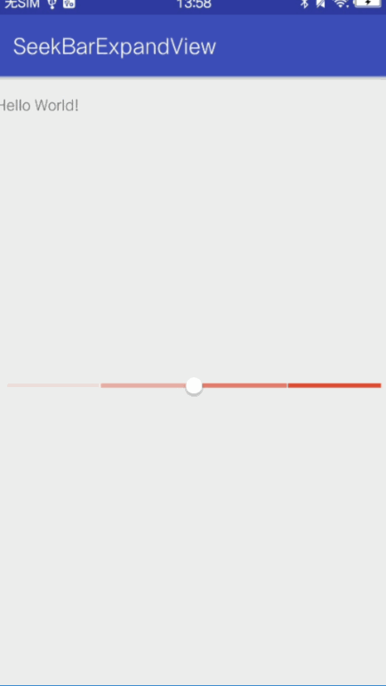

## SeekBarExpandView

奇技淫巧，使用`SeekBar`实现档位选择功能

## 预览

 

## 实现思路

**常用方法**

实现档位选择功能，肯定会想到`SeekBar`，因为它的`setOnSeekBarChangeListener`接口提供了`onProgressChanged`，`onStartTrackingTouch`，`onStopTrackingTouch`三个回调方法，极大的方便了处理滑动滑块到临界值的情况。

既然功能可以实现，接下来需要考虑的应该就是UI效果了。一般情况下，都可以通过定义`style`来解决。

尝试后发现，以上方法并不能实现如上预览图中显示的UI效果。

**另外两种实现方式**

第一种方式：自定义`View`。绘制UI，实现类似`SeekBar`的滑动功能

第二种方式：让美工切图作为SeekBar的`background`

**偶然想到的奇技淫巧**

设置SeekBar的背景为透明，使用FrameLayout将SeekBar置于background之上

## 解决的问题 

- 解决`SeekBar`默认`PaddingLeft`，`PaddingRight`的干扰，方便调整`SeekBar`整体显示位置
- 更加简单的为`Seekbar`添加复杂的`background`，而不需要通过自定义`View`的形式来实现，节约开发时间